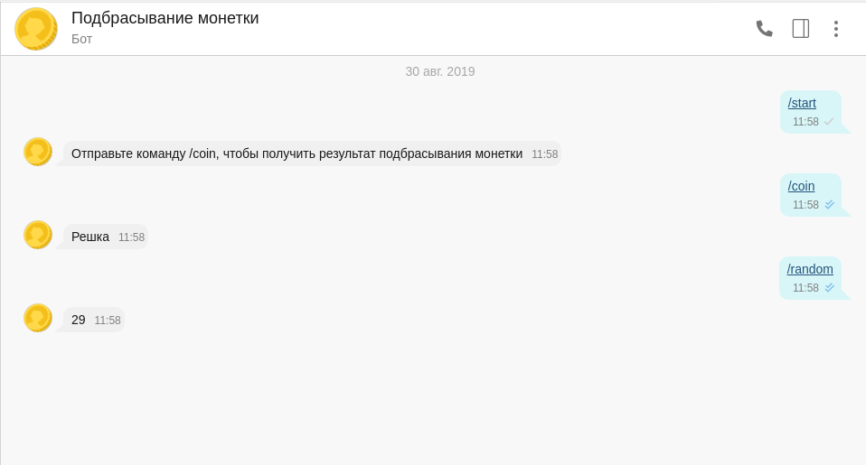

# COIN BOT
Бот "Подбрасывание монетки" для сервера РОСЧАТ

## Инициализация
Для успешного запуска бота cоздайте `bot/config.json` со следующим содержимым:
```json
{
	"baseUrl": "https://example.ros.chat",
	"token": "BOT_TOKEN",
	"name": "BOT_NAME"
}
```

Для запуска бота выполните команду
```bash

```

## Команды
* `/coin` - результат подбрасывания монетки
* `/random` - случайное число от 0 до 99

## Иллюстрация работы

